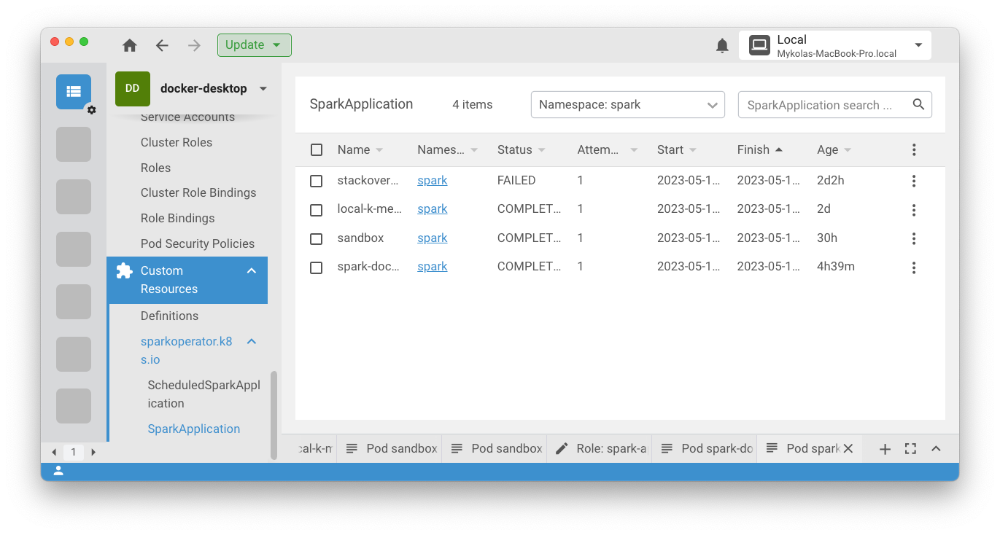

### Local setup
#### Mac
#### Prepare local env
- Enable Kubernetes in Docker Desktop or install minicube.
- Install Spark Operator with helm
  - Repo: https://github.com/GoogleCloudPlatform/spark-on-k8s-operator
  - ```helm repo add spark-operator https://googlecloudplatform.github.io/spark-on-k8s-operator```
  - ```helm install my-release spark-operator/spark-operator --namespace spark-operator --create-namespace```
- Prepare namespace for your application. Example - spark. 
- Prepare service account -> spark.
- Prepare Role with all permissions. -> generate with ChatGPT
- Assign role to service account.
```
apiVersion: rbac.authorization.k8s.io/v1
kind: RoleBinding
metadata:
  name: spark-role-binding
  namespace: spark
roleRef:
  apiGroup: rbac.authorization.k8s.io
  kind: Role
  name: spark-application-role
subjects:
- kind: ServiceAccount
  name: spark
  namespace: spark
```
```
kubectl apply -f <file.yaml> -n spark
```

### Run Spark application
#### Local mode
    - Use local value for master.
  ```  
  val conf = new SparkConf()
    .setMaster("local")
    .setAppName("my awesome app")
  ```
    - Run your application from IDE.
#### Cluster mode
    - Download Apache Spark distribution - https://spark.apache.org/downloads.html
    - Run master
      ```
      ./sbin/start-master.sh
      ```
      You can access master UI using the default URL http://localhost:8080/
    - Run worker
    ```
    ./sbin/start-worker.sh <master-url>
    ```
  - Assembly jar of your application.
  - Use spark-submit to deploy it.
  
  ```./bin/spark-submit --name "MyApp" --class com.arcadia.datamanipulator.CountingApp --master spark://localhost:7077  --driver-memory 1G --conf spark.executor.memory=4g --conf spark.cores.max=100 <path-to-spark-application-jar>```
#### Docker Desktop K8
    - Build docker of the application.
    - Push docker image to local registry ECR
    - Deploy the SparkApplication yaml to Kubernetes with kubectl.
```yaml
apiVersion: "sparkoperator.k8s.io/v1beta2"
kind: SparkApplication
metadata:
  name: spark-docker-scala
  namespace: spark
spec:
  type: Scala
  mode: cluster
  image: "localhost:5001/spark-pi:latest"
  imagePullPolicy: Always
  mainClass: org.apache.spark.examples.SparkPi
  mainApplicationFile: "local:///opt/spark/jars/spark-examples_2.12-3.3.2.jar"
  sparkVersion: "3.4.0"
  restartPolicy:
    type: Never
  volumes:
    - name: "test-volume"
      hostPath:
        path: "/tmp"
        type: Directory
  driver:
    cores: 1
    coreLimit: "1200m"
    memory: "512m"
    labels:
      version: 3.4.0
    serviceAccount: spark
    volumeMounts:
      - name: "test-volume"
        mountPath: "/tmp"
  executor:
    cores: 1
    instances: 1
    memory: "512m"
    labels:
      version: 3.4.0
    volumeMounts:
      - name: "test-volume"
        mountPath: "/tmp"
```
```
Save this yaml to SparkPI-spark-docker.yaml
```
Use this command to deploy application to the local k8s cluster:
```
kubectl apply -f SparkPI-spark-docker.yaml -n spark 
```
  - Check status of the application. 
    - using kubectl
    ```
      kubectl get sparkapplications -n spark
  
      NAME                  STATUS      ATTEMPTS   START                  FINISH                 AGE
      local-k-means         COMPLETED   1          2023-05-10T15:52:55Z   2023-05-10T15:53:00Z   2d
      sandbox               COMPLETED   1          2023-05-11T09:40:59Z   2023-05-11T09:41:05Z   30h
      spark-docker-scala    COMPLETED   1          2023-05-12T11:47:02Z   2023-05-12T11:47:12Z   4h37m
      stackoverflowkmeans   FAILED      1          2023-05-10T14:22:03Z   2023-05-10T14:22:11Z   2d2h
    ```
    - using Lens
    
    

#### AWS EKS
  - Install aws cli
    - https://docs.aws.amazon.com/cli/latest/userguide/getting-started-install.html
  - Build docker of the application.
  - Push docker image to AWS ECR
  - Deploy the SparkApplication yaml to EKS.
  - Check status of the application. 

#### Argo CD and Argo workflows
